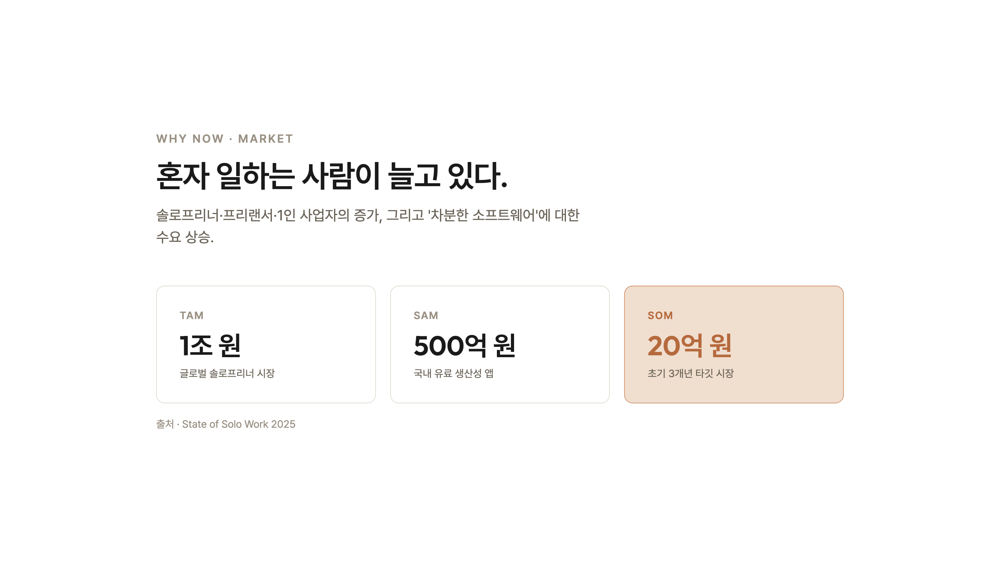

# Momento

> 여러 프로젝트, 지금의 답은 하나. — 혼자 일하는 사람을 위한 조용한 작업 공간.

**Momento**는 1인·프리랜서를 위한 미니멀 프로젝트 관리 웹앱입니다. 여러 프로젝트를
관리하되, 화면은 늘 **'지금 집중할 단 하나'**를 건네 압도감을 없앱니다. 붉은 배지·연체
카운트·달성률 % 같은 압박 신호를 쓰지 않는 것이 핵심 원칙입니다.

브랜드 한 줄: **"내 일의 순간들을, 조용히 정리하다."**

---

## 미리보기

> 라이브 데모(배포 후): 랜딩 `/` · 앱 `/momento/` · 피칭덱 `/pitch/` — Vercel URL을 여기에 기입하세요.

### 랜딩페이지 & 웹앱

| 랜딩페이지 | 웹앱 · 오늘 |
|---|---|
| [](./index.html) | [](./momento/index.html) |

### 투자자 피칭덱 · 12장

| 표지 | 시장 (TAM/SAM/SOM) |
|---|---|
|  |  |

전체 12장은 [`pitch/index.html`](./pitch/index.html) — 브라우저에서 **←/→**로 넘기거나 배포 후 `/pitch/`.

### SNS 출시 캐러셀 · 7장

| | | |
|---|---|---|
|  |  |  |

업로드용 PNG 7장: [`carousel/out/`](./carousel/out/).

---

## 리포 구성

| 경로 | 내용 | 배포 |
|------|------|------|
| [`index.html`](./index.html) | **랜딩페이지** — 히어로·철학·기능·FAQ·CTA | 🌐 공개 |
| [`momento/`](./momento/) | **웹앱** (hi-fi) — 오늘·전체 보기·프로젝트·메모함·상세 드로어 | 🌐 공개 |
| [`momento/tokens/`](./momento/tokens/) | **디자인 시스템 토큰** — 색·타이포·간격·폰트 | 🌐 공개 |
| [`pitch/`](./pitch/) | **투자자 피칭덱** — 12장 16:9 (아래 참고) | 🌐 공개 |
| [`carousel/`](./carousel/) | **SNS 출시 캐러셀** — 7장 + [`out/`](./carousel/out/) 업로드용 PNG | 🔒 비공개 |
| [`docs/`](./docs/) | **제품 문서** (PRD·화면정의서 등, 아래 참고) | 🔒 비공개 |
| [`archive/`](./archive/) | 초기 디자인 탐색 목업 | 🔒 비공개 |

'공개'는 Vercel 배포에 포함, '비공개'는 [`.vercelignore`](./.vercelignore)로 제외 — 리포에는 남아 있습니다.

---

## 실행

빌드 불필요. 브라우저로 바로 엽니다.

```bash
open index.html          # 랜딩페이지 → CTA로 앱 진입
open momento/index.html  # 웹앱 (상태는 localStorage에 저장)
```

유일한 외부 요청은 웹폰트 두 개(Pretendard·Outfit, CDN)입니다.

---

## 문서 (docs/)

| 문서 | 설명 |
|------|------|
| [PRD.md](./docs/PRD.md) | 제품 요구사항 (v2, 최신 프로토타입 기준) |
| [ui-spec.md](./docs/ui-spec.md) | 화면정의서 — 로그인·오늘·상세 드로어 등 화면/컴포넌트 정의 |
| [pitch-deck.md](./docs/pitch-deck.md) | 투자자 덱 슬라이드별 생성 프롬프트 + 반영 데이터 |
| [landing-PRD.md](./docs/landing-PRD.md) | 랜딩페이지 PRD |
| [release-carousel.md](./docs/release-carousel.md) | 출시 캐러셀 기획 |

---

## 투자자 피칭덱

[`pitch/index.html`](./pitch/index.html) — 12장 16:9 덱. 브라우저로 열고 **←/→·Space** 또는
화면 좌우 클릭으로 넘깁니다. `#6`처럼 해시로 특정 슬라이드에 바로 진입할 수 있고,
브라우저 "PDF로 저장"으로 내보낼 수 있습니다.

구성: 표지 · 문제 · 해결책 · 제품(지금 하나) · 사용법 · 시장 · 차별화 · 비즈니스 모델 ·
GTM · 트랙션/로드맵 · 팀 · 투자 요청/비전.

**공유** — 배포에 포함되어 `/pitch/` URL로 접근할 수 있습니다. 소비자 랜딩(`/`)에는 링크하지
않으므로, 주소를 아는 사람만 자연스럽게 찾아옵니다. 다시 비공개로 돌리려면
[`.vercelignore`](./.vercelignore)에 `pitch/` 한 줄을 추가하면 됩니다.

> 덱의 수치(시장 규모·가격·트랙션·투자 요청액 등)는 **샘플 데이터**입니다. 실제 투자 발표에
> 쓰려면 실제 값으로 교체하세요. 상세는 [docs/pitch-deck.md](./docs/pitch-deck.md).

---

## SNS 출시 캐러셀

[`carousel/index.html`](./carousel/index.html) — 7장 1350×1080 캐러셀. 이미지 소스이며
페이지로 링크하지 않습니다. 업로드용 PNG는 [`carousel/out/`](./carousel/out/)에 있습니다
(`01.png`–`07.png`, 각 2700×2160 @2x). `index.html?export`로 열면 크롬 없이 슬라이드만 캡처됩니다.

---

## Vercel 배포

정적 사이트라 별도 설정 없이 리포 루트를 배포하면 됩니다.

- **공개**: 랜딩 `/`(index.html) + 앱 `/momento/` + 피칭덱 `/pitch/`
- **비공개**([`.vercelignore`](./.vercelignore)): `docs/` · `carousel/` · `archive/` · `*.md`

```bash
vercel          # 프리뷰
vercel --prod   # 프로덕션
```

랜딩의 CTA는 `momento/index.html`(상대경로)로 연결되어 로컬·배포 양쪽에서 동작합니다.

---

## 브랜드 & 디자인 시스템

- **색**: 흰 배경 기본, 크림·웜그레이 서피스, 잉크 본문. **테라코타는 '지금 하나' 등 핵심 신호에만.**
- **금지**: 그라데이션, 붉은색·경고색, 달성률 %, 압박/재촉 카피.
- **타이포**: 본문 Pretendard, 워드마크 Outfit. 위계는 크기·굵기·여백으로.
- 토큰은 [`momento/tokens/`](./momento/tokens/)에 정의되어 랜딩·앱·덱·캐러셀이 모두 재사용합니다.

원 디자인 시스템·프로토타입은 Claude Design 프로젝트 *Momento Design System*에서 가져왔습니다.
